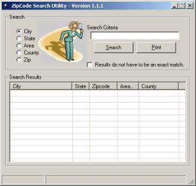



## City Search \- Version 1\.1

### Description

This utility is a simply searches the entire US city postal database to find your results. This is a revamped version of an earlier submission I made. You can search by city, state, zip code, area code, or by county. This code was well commented and should be a good example for anyone wanting to learn by example. The download is 736k since the database file itself is included in the download.
 
### More Info
 

             |
---                |---
**Submitted On**   |2003-04-10 10:52:38
**By**             |[L\. M\. Trivette ](https://github.com/Planet-Source-Code/PSCIndex/blob/master/ByAuthor/l-m-trivette.md)
**Level**          |Intermediate
**User Rating**    |5.0 (20 globes from 4 users)
**Compatibility**  |VB 4\.0 \(32\-bit\), VB 5\.0, VB 6\.0
**Category**       |[Complete Applications](https://github.com/Planet-Source-Code/PSCIndex/blob/master/ByCategory/complete-applications__1-27.md)
**World**          |[Visual Basic](https://github.com/Planet-Source-Code/PSCIndex/blob/master/ByWorld/visual-basic.md)
**Archive File**   |[City\_Searc1571844102003\.zip](https://github.com/Planet-Source-Code/l-m-trivette-city-search-version-1-1__1-44654/archive/master.zip)

